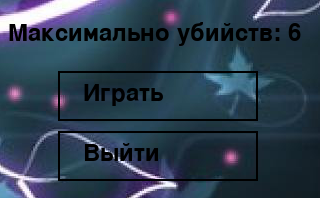
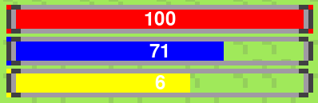
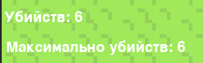
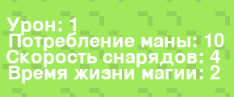
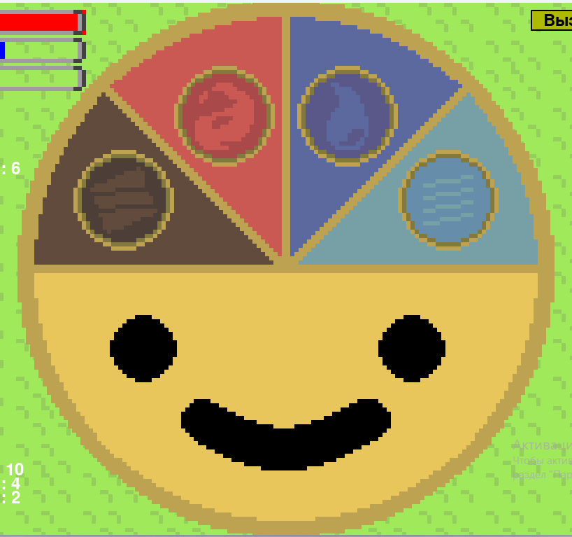
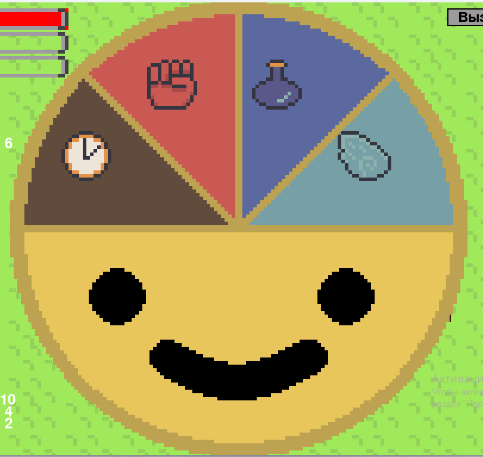

# Запуск
В папке проекта нужно запустить файл menu.py
Чтобы начать игру нужно нажать играть, чтобы выйти нужно нажать выйти

# Суть игры
Используйте стихии, чтобы убивать монстров, эксперементируйте и просто веселитесь

# Игровые механики
## Управление
    E - вызов меню выбора стихии
    Escape - Выход из игры
    Space - поставить на паузу
    w/a/s/d - ходьба героя
    1/2 - смена типа заклинания
## Интерфейс
Справа сверху располагаются показатели игрока ((сверху вниз) здоровье, мана, опыт) 

Чуть ниже располагается счёт (текущие колличество убийств и максимальное колличество убийств)

Слева снизу расположены характеристики игрока

Индикатор типа заклинания (Круг - снаряд, квадрат - постройка)
 

Правый верхний угол кнопка перехода на следующую волну (можно нажать только когда зелёная, то есть когда все враги убиты)

Меню выбора стихий (навестись на нужную стихию и нажать на неё)

Стихии слева направа (камень, огонь, вода, ветер)

Меню выбора прокачки (навестись на нужную прокачку и нажать на неё)

Прокачки слева направа (Время жизни снарядов, увеличение урона, уменьшение потребления маны, скорость)

## Виды заклинаний
### Камень
Каменный снаряд (маленькая скорость, высокая цена, большой урон)

Стена (не даёт врагам пройти)
### Огонь
Огненный снаряд (средняя скорость, средняя цена, средний урон)

Пожар (наносит переодический урон врагам)
### Вода
Водянной снаряд (средняя скорость, средняя цена, средний урон)

Лужа (замедляет пративников)
### Ветер
Ветрянной снаряд (большая скорость, маленькая цена, низкий урон)

Вихрь (затягивает в себя противников)